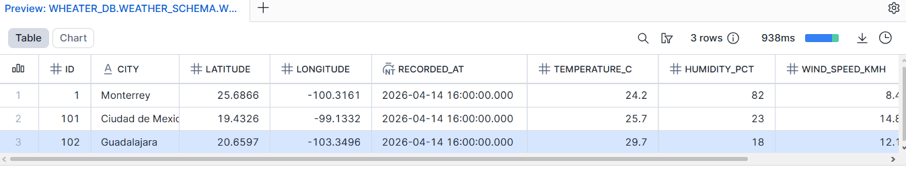

# Weather Data Extraction Pipeline
## Project Overview

This project implements a simple data pipeline that extracts weather data from the Open-Meteo API and loads it into Snowflake for storage and analysis.

The pipeline follows a basic EL (Extract and Load) approach, focusing on data ingestion into a cloud data warehouse.

 Technologies Used
Python
Snowflake
SQL
dotenv
 Data Source

##  Data Loaded in Snowflake

This is a preview of the data successfully loaded into Snowflake:



## Weather data is obtained from the Open-Meteo API:

https://open-meteo.com/
 Architecture

## The pipeline follows these steps:

Extract weather data from the API
Process the response (minimal transformation)
Load the data into Snowflake
Store the data in a structured table
## Project Structure
```weather_snowflake/
│
├── .venv/                      # Virtual environment (ignored in Git)
│
├── src/
│   ├── extract.py              # API data extraction logic
│   ├── load.py                 # Snowflake loading logic
│   └── main.py                 # Pipeline orchestration
│
├── .env                        # Local credentials (not committed)
├── .env.example                # Environment variables template
├── .gitignore                  # Ignored files
├── requirements.txt            # Project dependencies
└── README.md                   # Project documentation
```

Environment Variables 
###  Create a .env file based on .env.example:

SF_USER=your_user
SF_PASSWORD=your_password
SF_ACCOUNT=your_account

SF_WAREHOUSE=your_warehouse
SF_DATABASE=your_database
SF_SCHEMA=your_schema
SF_TABLE=WEATHER_TEMPERATURE
## Database Table

The data is stored in the following Snowflake table:
```
CREATE TABLE WEATHER_TEMPERATURE (
    CITY STRING,
    LATITUDE FLOAT,
    LONGITUDE FLOAT,
    RECORDED_AT TIMESTAMP,
    TEMPERATURE_C FLOAT,
    HUMIDITY_PCT FLOAT,
    WIND_SPEED_KMH FLOAT
);
```
# Installation

Clone the repository and install dependencies:

git clone <repo-url>
cd weather_snowflake

pip install -r requirements.txt

# Run the pipeline with:

python src/main.py
 Example Output
Insertado: Monterrey — 32.5°C
1 registros guardados en Snowflake.
